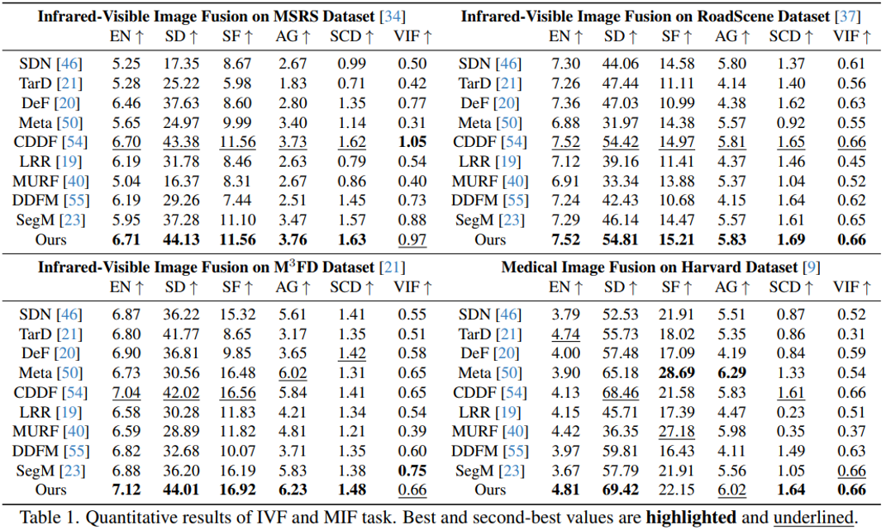

# EMMA
Codes for ***Equivariant Multi-Modality Image Fusion. (CVPR 2024)***

[Zixiang Zhao](https://zhaozixiang1228.github.io/), [Haowen Bai](), [Jiangshe Zhang](http://gr.xjtu.edu.cn/web/jszhang), [Yulun Zhang](https://yulunzhang.com/), [Kai Zhang](https://cszn.github.io/), [Shuang Xu](https://shuangxu96.github.io/), [Dongdong Chen](http://dongdongchen.com/), [Radu Timofte](https://www.informatik.uni-wuerzburg.de/computervision/home/) and [Luc Van Gool](https://vision.ee.ethz.ch/people-details.OTAyMzM=.TGlzdC8zMjQ4LC0xOTcxNDY1MTc4.html).

-[*[Paper]*]()  
-[*[ArXiv]*](https://arxiv.org/abs/2305.11443)  
-[*[Supplementary Materials]*]()  


## Update
- [2024/4] Release Training and inference code for EMMA.


## Citation

```
@InProceedings{Zhao_2024_CVPR,
    author    = {Zhao, Zixiang and Bai, Haowen and Zhang, Jiangshe and Zhang, Yulun and Zhang, Kai and Xu, Shuang and Chen, Dongdong and Timofte, Radu and Van Gool, Luc},
    title     = {Equivariant Multi-Modality Image Fusion},
    booktitle = {Proceedings of the IEEE/CVF Conference on Computer Vision and Pattern Recognition (CVPR)},
    month     = {June},
    year      = {2024},
    pages     = {}
}
```

## Abstract

Multi-modality image fusion is a technique that combines information from different sensors or modalities, enabling the fused image to retain complementary features from each modality, such as functional highlights and texture details. However, effective training of such fusion models is challenging due to the scarcity of ground truth fusion data. To tackle this issue, we propose the Equivariant Multi-Modality imAge fusion (EMMA) paradigm for end-to-end self-supervised learning. Our approach is rooted in the prior knowledge that natural imaging responses are equivariant to certain transformations. Consequently, we introduce a novel training paradigm that encompasses a fusion module, a pseudo-sensing module, and an equivariant fusion module. These components enable the net training to follow the principles of the natural sensing-imaging process while satisfying the equivariant imaging prior. Extensive experiments confirm that EMMA yields high-quality fusion results for infrared-visible and medical images, concurrently facilitating downstream multi-modal segmentation and detection tasks.

## 🌐 Usage
**1. Virtual Environment**

```
# create virtual environment
conda create -n emma python=3.8.10
conda activate emma
# select pytorch version yourself
# install emma requirements
pip install -r requirements.txt
```
**2. Network Architecture**

Our EMMA is implemented in ``Ufuser.py``.

### 🏄 Testing

**1. Pre-trained models**

Pre-trained models are available in ``'./model/EMMA.pth'``, ``'./model/Ai.pth'`` and ``'./model/Av.pth'``, which are responsible for the U-Fuser $\mathcal{F}(\cdot,\cdot)$ and Pseudo sensing module $\mathcal{A}_i(\cdot)$ and $\mathcal{A}_v(\cdot)$, respectively. 

**2. Test datasets**

Download the Infrared-Visible Fusion (IVF) and Medical Image Fusion (MIF) dataset and place the paired images in the folder ``'./test_img/'``.

**3. Results in our paper**

If you want to infer with our EMMA and obtain the fusion results in our paper, please run

```
python test.py
```

Then, the fused results will be saved in the ``'./test_result/'`` folder.

For the calculation of quantitative metrics, please refer to [CDDFuse](https://github.com/Zhaozixiang1228/MMIF-CDDFuse).

### 🏊 Training

**1. Data Preparation**
Download the MSRS dataset from [this link](https://github.com/Linfeng-Tang/MSRS) and place it in the folder ``'./dataprocessing/MSRS_train/'``.

**2. Pre-Processing**
* **2.0 (Optional) Pre-Processing for training Pseudo sensing module $\mathcal{A}_i(\cdot)$ and $\mathcal{A}_v(\cdot)$:**
    Fill in Line 18 of ``dataprocessing\MSRS_AiAv.py`` with the path to the SOTA fusion results needed for training. Then, 
    Run 
    ```
    python dataprocessing/MSRS_AiAv.py
    ``` 
    and the processed training dataset is in ``'./Data/MSRS_A_i_imgsize_128_stride_200.h5'`` and ``'./Data/MSRS_A_v_imgsize_128_stride_200.h5'``.
* **2.1 Pre-Processing for training U-Fuser $\mathcal{F}(\cdot,\cdot)$:**
    Run 
    ```
    python dataprocessing/MSRS_train.py
    ``` 
    and the processed training dataset is in ``'./Data/MSRS_train_imgsize_128_stride_200.h5'``.

**3. EMMA Training**
* **3.0 (Optional) Pseudo sensing module $\mathcal{A}_i(\cdot)$ and $\mathcal{A}_v(\cdot)$ training:**
    After generating the training data, run 
    ```
    python train_AiAv.py
    ``` 
    and the trained $\mathcal{A}_i(\cdot)$ and $\mathcal{A}_v(\cdot)$ models are available in ``'./models/'``. The Line 25 of ``train_AiAv.py`` can be used for selecting to train either $\mathcal{A}_i(\cdot)$ or $\mathcal{A}_v(\cdot)$.
* **3.1 U-Fuser $\mathcal{F}(\cdot,\cdot)$ training:**
    Run
    ```
    python train_Fusion.py
    ``` 
    and the trained U-Fuser $\mathcal{F}(\cdot,\cdot)$ model is available in ``'./models/'``.

## 🙌 EMMA Results

### Illustration of our EMMA model.


### Qualitative fusion results.


### Quantitative fusion results.



MM detection and MM segmentation


## 📖 Related Work

- Zixiang Zhao, Haowen Bai, Yuanzhi Zhu, Jiangshe Zhang, Shuang Xu, Yulun Zhang, Kai Zhang, Deyu Meng, Radu Timofte, Luc Van Gool.  
*DDFM: Denoising Diffusion Model for Multi-Modality Image Fusion.* **ICCV 2023 (Oral)**.    
https://arxiv.org/abs/2303.06840

- Zixiang Zhao, Haowen Bai, Jiangshe Zhang, Yulun Zhang, Shuang Xu, Zudi Lin, Radu Timofte, Luc Van Gool.   
*CDDFuse: Correlation-Driven Dual-Branch Feature Decomposition for Multi-Modality Image Fusion.* **CVPR 2023**.   
https://arxiv.org/abs/2211.14461

- Zixiang Zhao, Shuang Xu, Chunxia Zhang, Junmin Liu, Jiangshe Zhang and Pengfei Li.   
*DIDFuse: Deep Image Decomposition for Infrared and Visible Image Fusion.* **IJCAI 2020**.   
https://www.ijcai.org/Proceedings/2020/135.

- Zixiang Zhao, Shuang Xu, Jiangshe Zhang, Chengyang Liang, Chunxia Zhang and Junmin Liu.   
*Efficient and Model-Based Infrared and Visible Image Fusion via Algorithm Unrolling.* **IEEE Transactions on Circuits and Systems for Video Technology 2021**.   
https://ieeexplore.ieee.org/document/9416456.

- Zixiang Zhao, Jiangshe Zhang, Haowen Bai, Yicheng Wang, Yukun Cui, Lilun Deng, Kai Sun, Chunxia Zhang, Junmin Liu, Shuang Xu.   
*Deep Convolutional Sparse Coding Networks for Interpretable Image Fusion.* **CVPR Workshop 2023**.   
https://robustart.github.io/long_paper/26.pdf.

- Zixiang Zhao, Shuang Xu, Chunxia Zhang, Junmin Liu, Jiangshe Zhang.  
*Bayesian fusion for infrared and visible images.* **Signal Processing**.   
https://doi.org/10.1016/j.sigpro.2020.107734.

